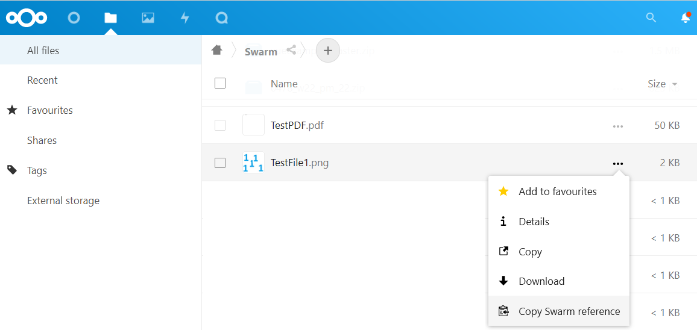

# Nextcloud Swarm Plugin

_Decentralized Sovereign cloud-storage comes to Nextcloud!_

This plugin brings [Swarm](https://www.ethswarm.org/) to [Nextcloud](https://nextcloud.com) - decentralized file-storage, connected to the blockchain.

<em>File view when using the plugin in Nextcloud</em>

## Table of Contents

-   [Dependencies](#dependencies)
-   [Setup and Installation](#setup-and-installation)
-   [Usage](#usage)
    -   [Settings](#settings)
    -   [Using Swarm](#using-swarm)
-   [License](#license)

## Dependencies

To use the plugin you need the following

-   A Nextcloud instance
-   A Bee node

## Setup and Installation

For setting up a Bee node please have a look at the [official documentation](https://docs.ethswarm.org/docs/installation/quick-start)

The following steps explain how to configure a Bee node in Nextcloud.

-   Run this command to start the development enviroment `docker compose up`, wait 10 seconds and naviagate to `localhost`
-   Navigate to Profile menu -> Settings -> Apps and make sure the "External Storage support" and "External Storage: Swarm" plugins are enabled
-   Navigate to External Storage Administration (Profile menu -> Settings -> External Storage)
-   Add the connection settings for a new Bee node, **make sure** Authentiation: none, Configuration is pointing to an active Bee node, and Available for: All users
-   Navigate to Ethswarm Storage Administration (Profile menu -> Settings -> Ethswarm Storage)
-   Configure the Bee node - by default, encryption is active, **make sure** stamp batch is actived by using the toggle
-   To use a Bee node, it is necessary to [Purchase a Batch of new stamps](https://docs.ethswarm.org/docs/access-the-swarm/keep-your-data-alive) from the funds in the node's wallet account
-   Once the new batch is purchased, a unique batchId is generated. Once your batch has been purchased, it will take a few minutes for other Bee nodes in the Swarm to catch up and register your batch. Allow some time for your batch to propagate in the network before proceeding to the next step. This is indicated by the checkbox "Usable".
-   Uploading files to the swarm costs Bzz, so it is necessary to select a Batch as "Active". Only 1 batch is allowed to be Active for a given Bee node. Then click "Save Settings".

## Usage

File handling operations involving the Bee node are integrated in the External Storage ("Files") section of Nextcloud.

<em>View, download, and file view actions in Nextcloud</em>

Using the plugin, the main file operations that are available in Nextcloud are:

-   Upload file(s) to a Bee node
-   Download and view files
-   Copy/Move files from any External Storage to a Bee node
-   Copy files from a Bee node to any External Storage
-   View and copy the unique swarm reference to the clipboard for any file stored on a Bee node

### Settings

Available to users with administrative credentials, the external storage accepts configuration options from two places, the normal External Storage settings, which allows a user to configure the basic connection properties of a Bee node:

<em>Basic Swarm setup in External Storage in Nextcloud administration</em>

Since every operation in Swarm costs money, it is important to view how much money is available to the Bee node directly and also provide a convenient way of handling the payment system in Swarm - all managed directly in Nextcloud. This is in a specific section with more advanced configuration for the Bee node, where the following settings can be viewed and edited:

-   Configure which Bee node to manage
-   View current status of the Bee node
-   Option to toggle encryption on and off
-   How much BZZ is available to the node
-   Any purchased stamp batches and the remaining balances
-   Have the option to purchase a new batch of stamps
-   Toggle the batch used for uploading files active/inactive

#### Using Bee node hosted on same server

If you are running the Bee node and Nextcloud using Docker containers on the same host, you cannot access the Bee node using `localhost` or `127.0.0.1` from within the Nextcloud container. Instead, you need to use the special DNS name `host.docker.internal` to access the host machine from within the container.

This is because `localhost` and `127.0.0.1` within the container refer to the container itself, not the host machine. The `host.docker.internal` DNS name is a special entry that resolves to the IP address of the host machine, allowing you to access services running on the host from within the container.

So, when configuring the Bee node connection in Nextcloud, use `host.docker.internal` instead of `localhost` or `127.0.0.1` for the IP address if your Bee node is running on the same host as the Nextcloud container.

<em>Advanced configuration of Swarm in Nextcloud administration</em>

### Using Swarm

Once setup and configured, the Bee node is ready to use.

-   Navigate to "Files" option on the menu -> "External Storage" and then the name of the Bee node.
-   Click to Upload file(s):

<em>Upload file to swarm in Nextcloud</em>

-   Once uploaded, it can be viewed internally or downloaded. It can also be copied to another storage.

<em>View, download, and file view actions in Nextcloud</em>

-   Files from another Nextcloud storage can also be copied/moved to the Bee node. Choose the Bee node as the target Folder

-   Right-click on a swarm file to copy the swarm reference (or hash) to the clipboard. Alternatively click the 3 dots of the Actions menu and select the menu option "Copy swarm reference". The swarm reference is the unique address of the file on the swarm.

<em>Copy swarm reference to clipboard</em>

## License

This program is licensed under the AGPLv3 or later.
